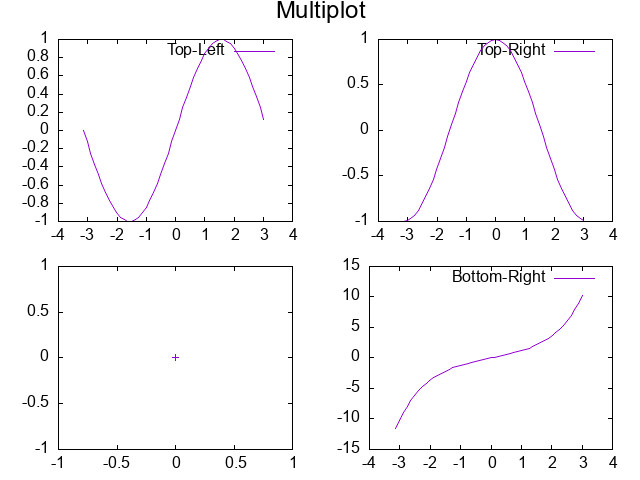

Plotpp
======

A plotting library for C++ that uses Gnuplot as a backend.

Allows plotting from custom containers/vectors if they use `begin()` and `end()` iterators as well as plotting from built in arrays.

Still under heavy developement!

Requirements
============
- Gnuplot:  
	[Homepage](http://gnuplot.info/index.html)  
	[Windows Download](https://sourceforge.net/projects/gnuplot/files/gnuplot/)  
	[Linux install](https://riptutorial.com/gnuplot/example/11275/installation-or-setup):
	```
	sudo apt-get update
	sudo apt-get install gnuplot
	```
	Note: The project can be build without gnuplot,
	since this library will only communicate with gnuplot through pipes. 
	But you will need gnuplot to display the graphical plots.
	
Examples
========

You can see all examples in the `examples/` folder.

Line Plot
---------

```C++
std::vector<double> x(20);
for(size_t i=0; i < x.size(); ++i) x[i] = i;
	
std::vector<double> y1(20);
for(size_t i=0; i < y1.size(); ++i) y1[i] = 1./i*30;

Figure fig("Line Plot");
fig.add(line(x, y1, "1/x*30"));
fig.show();
fig.save("line-plot.png");
```


Arrow Plot
----------

```C++
double arrow_x1[] = {-1, -2, -3, -4, -5};
double arrow_y1[] = {-1, -2, -1, -2, -3};
double arrow_x2[] = {-2, -3, -4, -5, -6};
double arrow_y2[] = {-3, -4, -2, -3, -5};

Figure fig("Arrow-Plot");
fig.add(arrows(arrow_x1, arrow_y1, arrow_x2, arrow_y2, "arrow plot", DataRelation::relative));
fig.show();
fig.save("arrows.svg");
```


Multiplot
---------

```C++
const auto x = linspace(-3.1415, 3.1415, 50);

Multiplot mplt(2, 2, "Multiplot");
mplt.at(0, 0).add(line(x, sin(x), "Top-Left"));
mplt.at(0, 1).add(line(x, cos(x), "Top-Right"));
mplt.at(1, 1).add(line(x, sinh(x), "Bottom-Right"));
mplt.show();
mplt.save("multiplot.jpg");
```



Integration
===========

With CMake CPM
--------------
Why would one use CPM? https://github.com/cpm-cmake/CPM.cmake
* CMake Package Manager
* Automatic Dependency Management in CMake
* Package Version Control
* Automatic Download and Build Integration

**Quick CPM Setup**:  
Download the `CPM.cmake` file and put in the folder `cmake` 
and includ it in your project. 
CPM will then automatically download and build all dependencies.

```cmake
include(cmake/CPM.cmake)

CPMAddPackage(
    NAME Plotpp
    GIT_REPOSITORY "https://github.com/TobiasWallner/Plotpp"
    GIT_TAG "main"
)

add_executable(PROJECT_NAME main.cpp)
target_link_libraries(PROJECT_NAME plotpp) 
```

**Automatic CPM Setup**:  
Use the following template to automatically download the CPM file 
and check if this project is a nested project in which case it will use the most upper CPM.cmake
instead of re-downloading it.
```cmake
cmake_minimum_required(VERSION 3.18.0)
 
project(PROJECT_NAME)

message(STATUS "======================== PROJECT_NAME: Fetching External Libraries =========================")

# -----------------------------------------------------------------
# 	CPM: An Awesome Dependency Manager for C++ with CMake
#		https://github.com/cpm-cmake/CPM.cmake
# -----------------------------------------------------------------

set(CPM_CMAKE_PATH "${CMAKE_SOURCE_DIR}/cmake/CPM.cmake")
set(CPM_CMAKE_URL "https://github.com/cpm-cmake/CPM.cmake/releases/download/v0.40.2/CPM.cmake")

# Check if CPM.cmake exists
if(NOT EXISTS "${CPM_CMAKE_PATH}")
    message(STATUS "CPM.cmake not found. Downloading from ${CPM_CMAKE_URL}...")
    file(DOWNLOAD ${CPM_CMAKE_URL} ${CPM_CMAKE_PATH} STATUS download_status LOG download_log)
    list(GET download_status 0 return_code)  # Get the numeric return code
	list(GET download_status 1 error_message)  # Get the error message
	if(return_code)
		file(REMOVE ${CPM_CMAKE_PATH}) #cleanup
		message(FATAL_ERROR "Error: ${error_message}.\n\tFailed to download CPM.cmake. Please check the URL and try again. Or manually place CPM.cmake in CPM_CMAKE_PATH=${CPM_CMAKE_PATH}.")
	else()
		message(STATUS "Successfuly downloaded CPM.cmake.")
    endif()
else()
    message(STATUS "CPM.cmake found at ${CPM_CMAKE_PATH}.")
endif()


include(${CPM_CMAKE_PATH})
option(CPM_USE_LOCAL_PACKAGES "Try `find_package` before downloading dependencies" ON)

# -----------------------------------------------------------------
# 					Add Modules / Dependencies
# -----------------------------------------------------------------

CPMAddPackage(
    NAME Plotpp
    GIT_REPOSITORY "https://github.com/TobiasWallner/Plotpp"
    GIT_TAG "main"
)


message(STATUS "======================== PROJECT_NAME: END: Fetching External Libraries =========================")


add_executable(PROJECT_NAME main.cpp)
target_link_libraries(PROJECT_NAME plotpp) 
```

With CMake Fetch Content
------------------------
```
include(FetchContent)
FetchContent_Declare(
  Plotpp
  GIT_REPOSITORY https://github.com/TobiasWallner/Plotpp.git
  GIT_TAG main
)
FetchContent_MakeAvailable(Plotpp)
```

Manually download the library and add it via `add_subdirectory`.
```cmake
add_subdirectory(path/to/Plotpp)
add_executable(PROJECT_NAME main.cpp)
target_link_libraries(YOUR_PROJECT_NAME PUBLIC plotpp)
```


